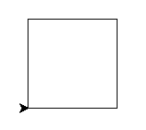

# Темы

- Модуль `turtle`
- Основные команды
- Примеры

## Проверка домашнего задания

## Модуль `turtle`

Модуль `turtle` - это модуль, который позволяет рисовать графику с помощью команд.

Чтобы начать рисовать, нужно подключить модуль `turtle` и создать объект `Turtle`:

```python
import turtle

t = turtle.Turtle()
```

## Основные команды

### Движение

- `forward(distance)` - двигаться вперед на `distance` пикселей
- `backward(distance)` - двигаться назад на `distance` пикселей
- `right(angle)` - повернуться на `angle` градусов вправо
- `left(angle)` - повернуться на `angle` градусов влево
- `goto(x, y)` - переместиться в точку с координатами `x` и `y`
- `setx(x)` - переместиться в точку с координатой `x`
- `sety(y)` - переместиться в точку с координатой `y`
- `setheading(angle)` - повернуться в направлении `angle` градусов
- `home()` - переместиться в начало координат

### Рисование

- `pendown()` - опустить перо
- `penup()` - поднять перо
- `pensize(width)` - установить ширину пера
- `pencolor(color)` - установить цвет пера
- `fillcolor(color)` - установить цвет заливки
- `begin_fill()` - начать заливку
- `end_fill()` - закончить заливку
- `dot(size, color)` - нарисовать точку размера `size` и цвета `color`
- `stamp()` - нарисовать копию черепашки

### Очистка экрана

- `clear()` - очистить экран
- `reset()` - очистить экран и вернуть черепашку в начало координат

### Настраиваемые параметры

- `speed(speed)` - установить скорость черепашки
    - `speed = 0` - черепашка рисует очень быстро
    - `speed = 1` - черепашка рисует медленно (по умолчанию)
    - `speed = 2..10` - черепашка рисует чуть быстрее
- `shape(shape)` - установить форму черепашки
    - `arrow`, `turtle`, `circle`, `square`, `triangle`, `classic`
- `resizemode(mode)` - установить режим изменения размера черепашки
- `shapesize(stretch_wid, stretch_len, outline)` - установить размер черепашки
- `showturtle()` - показать черепашку
- `hideturtle()` - скрыть черепашку

### Состояние черепашки

- `isdown()` - проверить, опущено ли перо
- `isvisible()` - проверить, видна ли черепашка
- `position()` - получить текущую позицию черепашки
- `xcor()` - получить текущую координату `x` черепашки
- `ycor()` - получить текущую координату `y` черепашки
- `heading()` - получить текущее направление черепашки
- `towards(x, y)` - получить направление до точки с координатами `x` и `y`
- `distance(x, y)` - получить расстояние до точки с координатами `x` и `y`

### Примеры и разбор

#### Важное замечание: чтобы экран черепашки не закрывался, нужно добавить в конце программы `turtle.done()`.

1. Давайте напишем программу, которая рисует квадрат.



```python
import turtle

t = turtle.Turtle()

t.forward(100)
t.left(90)
t.forward(100)
t.left(90)
t.forward(100)
t.left(90)
t.forward(100)
t.left(90)
```

Теперь самостоятельно напишите программу, используя цикл `for` и функцию `range()`, которая рисует квадрат.

2. Давайте напишем программу, которая рисует круг.

```python
import turtle

t = turtle.Turtle()

for i in range(360):
    t.forward(1)
    t.left(1)
```

Круг можно нарисовать и с помощью функции `circle()`. Она принимает два аргумента: радиус и угол. Если угол не указан,
то рисуется вся окружность.

```python
import turtle

t = turtle.Turtle()

t.circle(100)
```

3. Давайте напишем программу, которая рисует звезду.

```python
import turtle

t = turtle.Turtle()

for i in range(5):
    t.forward(100)
    t.left(144)
```

## Самостоятельная работа, она же домашнее задание

1. Нарисуйте домик.
    1. в доме должно быть 4 окна
    2. в доме должна быть дверь
    3. на крыше должен быть дымоход
    4. Всё это должно быть разного цвета
2. Нарисуйте дерево.
3. Нарисуйте солнце.
4. Нарисуйте луну.

### Подсказки

- используйте функцию `color()` или `pencolor()` для установки цвета черепашки.
- для прекращения рисования используйте функцию `penup()` и для возобновления рисования `pendown()`.
- для установки ширины линии используйте функцию `width()`.
- для быстрой отрисовки можно изменить скорость черепашки с помощью функции `speed()`.
- для установки цвета заливки используйте функцию `fillcolor()`.
- для заливки фигуры используйте функцию `begin_fill()` и `end_fill()`.
- для рисования круга используйте функцию `circle()`.
- для рисования прямоугольника используйте функцию `rectangle()`.


    


